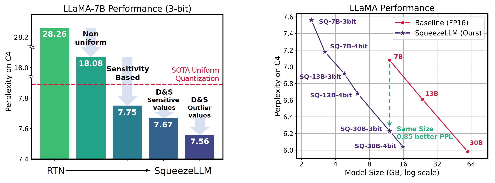

# SqueezeLLM: Dense-and-Sparse Quantization [[Paper](https://arxiv.org/abs/2306.07629)]




SqueezeLLM is a post-training quantization framework that incorporates a new method called Dense-and-Sparse Quantization to enable efficient LLM serving. 

TLDR:
Deploying LLMs is difficult due to their large memory size. This can be addressed with reduced precision quantization. But a naive method hurts performance. We address this with a new Dense-and-Sparse Quantization method.
Dense-and-Sparse splits weight matrices into two components: A dense component that can be heavily quantized without affecting model performance, as well as a sparse part that preserves sensitive and outlier parts of the weight matrices
With this approach, we are able to serve larger models with smaller memory footprint, the same latency, and **yet higher accuracy and quality**.
For instance, the Squeeze variant of the Vicuna models can be served within 6 GB of memory and reach 2% higher MMLU than the baseline model in FP16 with an even 2x larger memory footprint.
For more details please check out our [paper](https://arxiv.org/abs/2306.07629).


**Updates:** Vicuna-7B and 13B, and LLaMA-30B are all supported with both 3-bit and 4-bit. 

---
## Installation

1. Create a conda environment
```
conda create --name sqllm python=3.9 -y
conda activate sqllm
```

2. Clone and install the dependencies
```
git clone https://github.com/SqueezeAILab/SqueezeLLM
cd SqueezeLLM
pip install -e .
cd squeezellm
python setup_cuda.py install
```

---

## Supported Models

Currently, we support [LLaMA](https://arxiv.org/abs/2302.13971) 7B, 13B, and 30B, as well as the instruction-tuned [Vicuna](https://lmsys.org/blog/2023-03-30-vicuna/) 7B and 13B.
For each model, we support 3-bit and 4-bit quantized models, with sparse levels of 0% (dense-only), 0.05%, and 0.45%.
See our [Paper](https://arxiv.org/abs/2306.07629) for more detailed information on these configurations.
Below are the links to download the models.

### LLaMA

| Model |  Bitwidth | Dense-only (0%) |
| -------- | -------- | -------- |
| LLaMA-7B    | 3   |  [sq-llama-7b-w3-s0](https://huggingface.co/squeeze-ai-lab/sq-llama-7b-w3-s0/blob/main/sq-llama-7b-w3-s0.pt) |
| LLaMA-7B    | 4   | [sq-llama-7b-w4-s0](https://huggingface.co/squeeze-ai-lab/sq-llama-7b-w4-s0/blob/main/sq-llama-7b-w4-s0.pt) |
| LLaMA-13B    | 3   |  [sq-llama-13b-w3-s0](https://huggingface.co/squeeze-ai-lab/sq-llama-13b-w3-s0/blob/main/sq-llama-13b-w3-s0.pt) |
| LLaMA-13B    | 4   | [sq-llama-13b-w4-s0](https://huggingface.co/squeeze-ai-lab/sq-llama-13b-w4-s0/blob/main/sq-llama-13b-w4-s0.pt) |
| LLaMA-30B    | 3   |  [sq-llama-30b-w3-s0](https://huggingface.co/squeeze-ai-lab/sq-llama-30b-w3-s0/blob/main/sq-llama-30b-w3-s0.pt) |
| LLaMA-30B    | 4   | [sq-llama-30b-w4-s0](https://huggingface.co/squeeze-ai-lab/sq-llama-30b-w4-s0/blob/main/sq-llama-30b-w4-s0.pt) |

### Vicuna

| Model |  Bitwidth | Dense-only (0%) |
| -------- | -------- | -------- |
| Vicuna-7B    | 3   | [sq-vicuna-7b-w3-s0](https://huggingface.co/squeeze-ai-lab/sq-vicuna-7b-w3-s0/blob/main/sq-vicuna-7b-w3-s0.pt) |
| Vicuna-7B    | 4     | [sq-vicuna-7b-w4-s0](https://huggingface.co/squeeze-ai-lab/sq-vicuna-7b-w4-s0/blob/main/sq-vicuna-7b-w4-s0.pt)  |
| Vicuna-13B    | 3     | [sq-vicuna-13b-w3-s0](https://huggingface.co/squeeze-ai-lab/sq-vicuna-13b-w3-s0/blob/main/sq-vicuna-13b-w3-s0.pt)  |
| Vicuna-13B    | 4    | [sq-vicuna-13b-w4-s0](https://huggingface.co/squeeze-ai-lab/sq-vicuna-13b-w4-s0/blob/main/sq-vicuna-13b-w4-s0.pt)  |

**NOTE:** Sparsity levels with 0.05% and 0.45% are coming soon!

The LLaMA model [license](https://github.com/facebookresearch/llama/blob/main/LICENSE) is currently only available for research purposes. We direct everyone to carefully review the license before using the quantized models.
Similar to other works on LLaMA, we only release the quantized portions of the model in [Huggingface Model Hub](https://huggingface.co/squeeze-ai-lab). 
To successfully run our code, you need to first obtain the original, pre-trained LLaMA model in the Huggingface-compatible format locally and provide the path in the commands below. 
We have scripts that will substitute the necessary components, but you will need the original model for those scripts to run.


### Benchmarking

The following code will run and benchmark the 3-bit quantized LLaMA-7B model on the C4 dataset. The `--torch_profile` argument can be passed when running benchmarking to replicate the runtime results from the paper.
Download the quantized model (e.g. `sq-llama-7b-w3-s0.pt`) locally from the link above.
You can follow the same procedure for other quantized models.

```
CUDA_VISIBLE_DEVICES=0 python llama.py <path-to-llama-7b-hf> c4 --wbits 3 --load sq-llama-7b-w3-s0.pt --benchmark 128 --check
```

### Perplexity Evaluation

The following code will evaluate perplexity using the 3-bit quantized LLaMA-7B model on the C4 dataset, following the same evaluation methodology of [GPTQ](https://github.com/IST-DASLab/gptq) and [GPTQ-For-LLaMA](https://github.com/qwopqwop200/GPTQ-for-LLaMa/).
Download the quantized model (e.g. `sq-llama-7b-w3-s0.pt`) locally from the link above.
You can follow the same procedure for other quantized models.
```
CUDA_VISIBLE_DEVICES=0 python llama.py <path-to-llama-7b-hf> c4 --wbits 3 --load sq-llama-7b-w3-s0.pt --eval
```

The code was tested on A5000 and A6000 GPUs with Cuda 11.3 and CUDNN 8.2.

---
## Acknowledgement

This code reuses components from several libraries including [GPTQ](https://github.com/IST-DASLab/gptq) as well as [GPTQ-For-LLaMA](https://github.com/qwopqwop200/GPTQ-for-LLaMa/).

---

## Citation

SqueezeLLM has been developed as part of the following paper. We appreciate it if you would please cite the following paper if you found the library useful for your work:

```
@article{kim2023squeezellm,
  title={SqueezeLLM: Dense-and-Sparse Quantization},
  author={Kim, Sehoon and Hooper, Coleman and Gholami, Amir and Dong, Zhen and Li, Xiuyu and Shen, Sheng and Mahoney, Michael and Keutzer, Kurt},
  journal={arXiv},
  year={2023}
}
```
